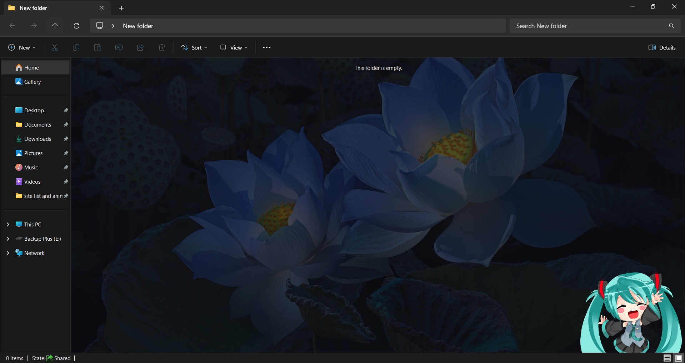
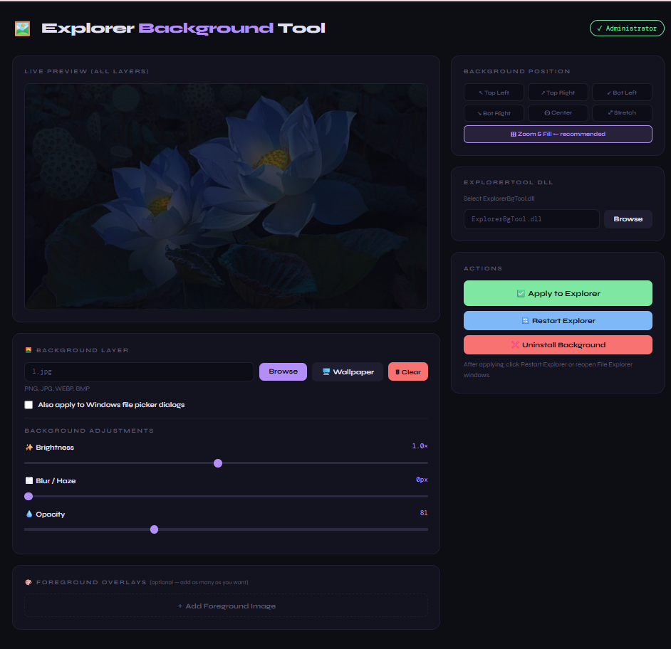
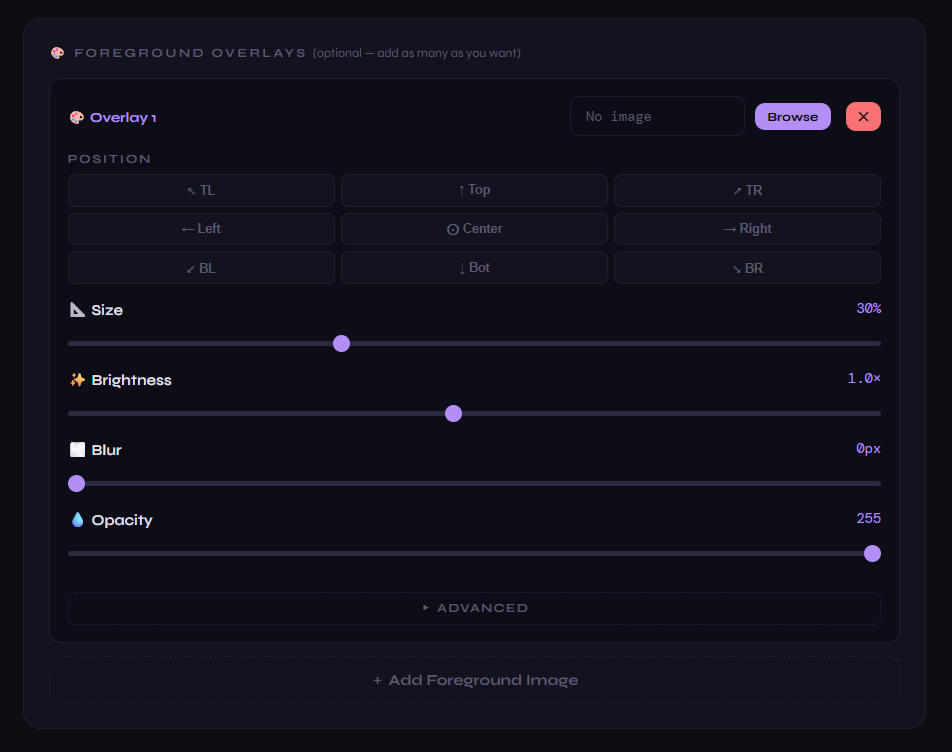

# 🖼️ Explorer Background Tool

Set a **custom background image** in Windows File Explorer — with live preview, brightness, blur, opacity controls, foreground overlays, desktop wallpaper sync, and auto-start on boot.

Built with Python + a browser-based UI. Works on **Windows 10 and Windows 11**.

> ⚠️ This tool uses a DLL hook to inject a background into Explorer. It works great but Microsoft occasionally patches these hooks in major Windows Updates — if your background disappears after an update, just click Apply again in the app.

---

## 📸 Preview

```
┌─────────────────────────────────────────────────────────┐
│  > This PC                          🔍 Search This PC   │
├─────────────────┬───────────────────────────────────────┤
│ 🏠 Home         │                                       │
│ 🖼️  Gallery     │   [ Your beautiful image fills here ] │
│                 │                              🎨       │
│ 📁 Desktop      │      🌸 anime / artwork / photo       │
│ 📁 Documents    │                           [logos!]    │
│ 📁 Downloads    │                                       │
└─────────────────┴───────────────────────────────────────┘
```



---

## ✅ Requirements

| Requirement | How to get it |
|---|---|
| **Windows 10 or 11** | You already have it 😄 |
| **Python 3.8+** | [python.org/downloads](https://python.org/downloads) |
| **Pillow** | Auto-installed by `start.bat` |

> 🔴 **Critical during Python install:** Check **"Add Python to PATH"**
> ```
> ☑  Add Python to PATH   ← tick this, it's unchecked by default!
> ```
> or one can simply use below command example in cmd admin mode to install any Python version 3.8+ **(this Auto-Adds Python to PATH)**
> ```bash
> winget install -e --id Python.Python.3.13
> ```

---

## 📦 What's in this repo

**Right after cloning:**
```
ExplorerBgTool/
│
├── 📄 explorer_bg_tool.py      ← The main app (Python)
├── 📄 wallpaper_watcher.py     ← Standalone wallpaper sync watcher
├── 📄 ExplorerBgTool.dll       ← The DLL that hooks into Explorer
│
├── 🖱️ start.bat                ← START HERE — launches the control panel
├── 🖱️ SETUP_AUTOSTART.bat      ← Run once to survive reboots
├── 📄 setup_autostart.ps1      ← Called by SETUP_AUTOSTART.bat (don't delete)
├── 🖱️ REMOVE_AUTOSTART.bat     ← Removes auto-start if you want to undo
│
└── 📄 README.md                ← You are here!
```

**After running the app for the first time, these appear automatically:**
```
ExplorerBgTool/
│
├── 📄 bg_config.json           ← Your saved settings (auto-created)
├── 📄 config.ini               ← explorerTool config (auto-created on Apply)
├── 📄 launch_bg_silent.vbs     ← Silent boot launcher (auto-created by SETUP_AUTOSTART)
│
├── 📁 image/
│   └── 🖼️ bg_custom.png        ← Your processed & composited background (auto-created)
│
└── 📁 .wallpaper_cache/
    ├── 🖼️ current_wallpaper.jpg ← Desktop wallpaper copy (if wallpaper mode used)
    └── 📄 watcher.log          ← Wallpaper watcher activity log
```

---

## 🚀 Setup Guide

### Step 1 — Clone the repo

```bash
git clone https://github.com/SuryaMajumder/ExplorerBgTool.git
```

Or click **Code → Download ZIP** on GitHub and extract it anywhere (Desktop, C drive, wherever).

---

### Step 2 — Launch the control panel

Double-click **`start.bat`**

```
start.bat
 └─→ asks for admin privileges → click Yes
     └─→ auto-installs Pillow if missing
         └─→ opens your browser at http://127.0.0.1:57821
```

> 💡 The CMD window that opens must stay open in the background — it's the server powering the browser UI. Don't close it while using the app.

The browser control panel looks like this:

```
┌──────────────────────────────────────────────────────────────────────────┐
│  🖼️  Explorer Background Tool                         ✓ Administrator   │
├───────────────────────────────────────┬──────────────────────────────────┤
│                                       │  BACKGROUND POSITION             │
│   [ Live Preview — all layers ]       │  ↖ TL  ↑ Top  ↗ TR              │
│                                       │  ← Left ⊙ Ctr → Right           │
│   Background + overlays composited    │  ↙ BL  ↓ Bot  ↘ BR              │
│   in real time!                       │  ⊞ Zoom & Fill  ← recommended!  │
│                                       ├──────────────────────────────────┤
├───────────────────────────────────────┤  EXPLORERTOOL DLL                │
│  🌄 BACKGROUND LAYER                  │  [ ExplorerBgTool.dll ] [Browse] │
│  [ image.jpg ] [Browse][🖥️ Wallpaper] ├──────────────────────────────────┤
│               [🗑 Clear]               │  ACTIONS                         │
│  ✨ Brightness  ───●─────  1.0×       │  ✅  Apply to Explorer          │
│  🎨 Contrast    ───●─────  1.0×       │  🔄  Restart Explorer           │
│  🌫️ Blur/Haze   ●─────────  0px       │  ❌  Uninstall Background       │
│  💧 Opacity     ──────●──  255        │                                 │
├───────────────────────────────────────┴──────────────────────────────────┤
│  🎨 FOREGROUND OVERLAYS  (optional — add as many as you want)            │
│  ┌─────────────────────────────────────────────────────────────────────┐ │
│  │ 🎨 Overlay 1   [ chibi.png ]  [Browse]  [✕]                        │ │
│  │ Position: ↖TL  ↑Top  ↗TR  ←Left  ⊙Ctr  →Right  ↙BL  ↓Bot  ↘BR     │ │
│  │ 📐 Size  ──●──────  30%    ✨ Brightness  ──●──  1.0×              │ │
│  │ 🌫️ Blur  ●────────   0px   💧 Opacity     ──────●──  255           │ │
│  └─────────────────────────────────────────────────────────────────────┘ │
│  [ + Add Foreground Image ]                                              │
└──────────────────────────────────────────────────────────────────────────┘
```


---

### Step 3 — Pick your background image

Click **Browse** under the **🌄 BACKGROUND LAYER** section and select any image file:

| Supported formats |
|---|
| `.png` `.jpg` `.jpeg` `.webp` `.bmp` |

The **Live Preview** box updates instantly — what you see there is exactly what Explorer will show.

You have three options for the background:

| Button | What it does |
|---|---|
| **Browse** | Pick any image from your PC |
| **🖥️ Wallpaper** | Use your current desktop wallpaper (auto-syncs if Spotlight!) |
| **🗑 Clear** | Remove the background image (overlays remain untouched) |
| **☑ Also apply to Windows file picker dialogs** | When checked, your background + overlays also appear in Save As / Open File dialogs system-wide |

---

### Step 4 — Adjust to your taste

| Slider | What it does | Sweet spot |
|---|---|---|
| **✨ Brightness** | Makes the image lighter or darker | `0.4–0.7×` — dim it so folder icons stay readable |
| **🎨 Contrast** | Increases or decreases image contrast | `0.8–1.3×` — subtle boost makes colors pop |
| **🌫️ Blur / Haze** | Adds a frosted-glass dreamy haze | `3–8px` for a subtle glow effect |
| **💧 Opacity** | How see-through the image is | `80–180` balances beauty and readability |

> 💡 Watch the Live Preview as you drag — it updates after you release the slider. (P.S.: Dark Mode of Windows gives better vibe with darker backgrounds than Light mode and vice-versa.)

---

### Step 5 — Choose background position

| Option | What it does | When to use it |
|---|---|---|
| ↖ Top Left | Anchors to top-left, no scaling | Fixed decorative corner image |
| ↗ Top Right | Anchors to top-right, no scaling | Fixed decorative corner image |
| ↙ Bot Left | Anchors to bottom-left, no scaling | Fixed decorative corner image |
| ↘ Bot Right | Anchors to bottom-right, no scaling | Fixed decorative corner image |
| ⊙ Center | Centers the image, no scaling | Small icons or logos |
| ⤢ Stretch | Stretches to fill the window | May distort the image |
| **⊞ Zoom & Fill** | **Scales to always fill — no cutoff** | **Use this! Best for photos & artwork** |

> ✅ **Recommendation: always use Zoom & Fill.** It makes the image resize perfectly with your Explorer window no matter how you drag or snap it. Unless using anime figures which stays at fixed positions.

---

### Step 6 — (Optional) Add foreground overlays 🎨

This is where it gets fun! You can pin **any number of images** on top of your background — like anime chibis, stickers, logos, or artwork — each independently positioned and styled.

Click **`+ Add Foreground Image`** at the bottom of the page. Each overlay gets its own card:

```
┌────────────────────────────────────────────────────────┐
│ 🎨 Overlay 1   [ chibi.png ]  [Browse]  [✕ Remove]    │
│                                                        │
│ POSITION  (pick where it's pinned)                     │
│  ↖ TL    ↑ Top   ↗ TR                                 │
│  ← Left  ⊙ Ctr  → Right                               │
│  ↙ BL    ↓ Bot   ↘ BR  ← (default)                    │
│                                                        │
│ 📐 Size        ──●──────  30%   (% of screen height)  │
│ ✨ Brightness  ──●──────  1.0×                         │
│ 🌫️ Blur        ●────────   0px                         │
│ 💧 Opacity     ──────────  255                         │
│                                                        │
│ ▸ ADVANCED  (click to expand)                          │
│  ↔️ Left→Right  ──────●──  100%  (custom X position)   │
│  ↕️ Top→Bottom  ──────●──  100%  (custom Y position)   │
│  🎨 Contrast   ───●──────  1.0×                        │
│  [↔ Flip H]  [↕ Flip V]                               │
│  🔄 Rotation   ───●──────  0°                          │
└────────────────────────────────────────────────────────┘
```


**What each overlay control does:**

| Control | What it does | Tips |
|---|---|---|
| **Browse** | Pick the overlay image | PNG with transparent background works best! |
| **✕ Remove** | Delete this overlay | Preview updates instantly |
| **Position grid (3×3)** | Pin the overlay to any of 9 positions | TL/TR/BL/BR for corners, Top/Bot/Left/Right for edges, Center for middle |
| **📐 Size** | Scale the overlay (5%–80% of screen height) | 20–35% looks natural for character art |
| **✨ Brightness** | Brighten or dim the overlay independently | Keep at 1.0× for crisp artwork |
| **🌫️ Blur** | Blur the overlay | 0 for sharp, 2–5 for dreamy/ghosted effect |
| **💧 Opacity** | How transparent the overlay is | 180–255 for solid, lower for ghosted |
| **▸ ADVANCED** | Expand for fine-tuning controls | Click to toggle open/closed |
| **↔️ Left→Right** | Custom X position (0%=left edge, 100%=right edge) | Overrides the 9-position grid for pixel-perfect placement |
| **↕️ Top→Bottom** | Custom Y position (0%=top, 100%=bottom) | Use with Left→Right for full free positioning |
| **🎨 Contrast** | Increase or decrease overlay contrast independently | 1.0× = no change |
| **↔ Flip H** | Mirror the overlay horizontally | Toggle — highlighted when active |
| **↕ Flip V** | Mirror the overlay vertically | Toggle — highlighted when active |
| **🔄 Rotation** | Rotate the overlay 0°–359° | Applied after flipping |

> 💡 **Pro tip:** Use a PNG with a transparent background for your overlays (like chibi character art) — the transparency is fully preserved so only the character appears, with no white/solid box around it!

> 💡 **Overlay position is fixed** — unlike the background which can Zoom & Fill, overlays are always pinned to their chosen corner/edge regardless of how you resize the Explorer window. This is intentional — it keeps your chibi army exactly where you want them!

> 💡 **Custom positioning** — the 9 position buttons are shortcuts. For pixel-perfect placement, open **▸ ADVANCED** and use the Left→Right / Top→Bottom sliders. Dragging these deactivates the 9 buttons (custom mode). Clicking any position button snaps the sliders back to that anchor and re-activates it.

> 💡 **No background needed** — you can use overlays without any background image! In that case, Explorer's own theme color (light/dark) shows through naturally.

You can add as many overlays as you want. They all composite into one final image before being sent to Explorer.

---

### Step 7 — Point to the DLL

Under **EXPLORERTOOL DLL**, click **Browse** and select `ExplorerBgTool.dll` from your folder.

> You only need to do this once. The path is saved in `bg_config.json` automatically.

---

### Step 8 — Apply!

1. Click **✅ Apply to Explorer**
   - A green message appears: *"Applied! Now restart Explorer."*
2. Click **🔄 Restart Explorer**
   - This briefly closes and reopens Explorer (all windows will flash — that's normal)

Open File Explorer and enjoy your background! 🎉

> 💡 Note background doesn't appear at Home and Gallery of File Explorer. You can browse to any other location and your background will appear.

> 💡 Want your background in Windows file picker dialogs too (Save As, Open File, etc.)? Tick **☑ Also apply to Windows file picker dialogs** before clicking Apply!

---

## 🖥️ Desktop Wallpaper Sync

Instead of picking a custom image, you can use your **current desktop wallpaper** as the Explorer background — and keep it in sync automatically!

Click **🖥️ Wallpaper** in the Background Layer section. The app will:
1. Copy your current desktop wallpaper (works with both custom wallpapers and Windows Spotlight)
2. Apply it as your Explorer background
3. Show a green **⟳ auto-sync** badge

```
🌄 BACKGROUND LAYER
[ current_wallpaper.jpg ] [Browse] [🖥️ Wallpaper] [🗑 Clear]  ⟳ auto-sync
```

When auto-sync is on, the app checks every **30 minutes** for wallpaper changes. If your Spotlight wallpaper rotated, it automatically re-applies the new one to Explorer — silently, no popups.

**To turn off auto-sync:** just click **Browse** and pick a custom image. The badge disappears and the watcher stops.

| Wallpaper type | Button works? | Auto-sync works? |
|---|---|---|
| Custom image (static) | ✅ | ✅ stays fixed, watcher idles |
| Windows Spotlight | ✅ | ✅ updates when Spotlight rotates |
| Solid color desktop | ❌ no image to grab | — |

---

## 🔁 Making it survive reboots (do this once)

By default the background resets when you restart Windows. Run this once to fix that:

**Prerequisites:** Complete Steps 2–8 above first so `bg_config.json` exists.

1. Double-click **`SETUP_AUTOSTART.bat`**
2. Click **Yes** on the admin prompt
3. A green message confirms everything is registered

To verify it worked:
- Press `Win + R` → type `taskschd.msc` → hit Enter
- Look for both tasks in the Task Scheduler list:

```
Task Scheduler Library
├── ✅ ExplorerBgTool      ← applies background on every login (always runs)
└── ✅ ExplorerBgWatcher   ← wallpaper auto-sync watcher (exits if not in wallpaper mode)
```

From now on your background applies silently every time you log into Windows — no CMD window, no browser, just instant background. Exactly like a wallpaper.

**What each task does on login:**

| Task | What it does | When it runs |
|---|---|---|
| **ExplorerBgTool** | Registers the DLL — instantly applies last saved background | Always, every login |
| **ExplorerBgWatcher** | Checks if wallpaper changed, re-applies if yes | Only when wallpaper mode is ON, exits immediately otherwise |

---

## 🔄 Changing your background later

Just run `start.bat` anytime:

```
start.bat → Browse new image → adjust sliders → ✅ Apply → 🔄 Restart Explorer
```

Settings save automatically. No need to run SETUP_AUTOSTART again.

---

## ❌ Removing the background

### Option A — Temporarily remove from the app
```
start.bat → ❌ Uninstall Background → 🔄 Restart Explorer
```

### Option B — Remove auto-start too (full uninstall)
```
1. start.bat → ❌ Uninstall Background → 🔄 Restart Explorer
2. Double-click REMOVE_AUTOSTART.bat → click Yes
```

### Option C — Emergency (Explorer crashes on open)

If Explorer keeps crashing after a Windows Update broke the hook:

```
1. Hold ESC and click Explorer in the taskbar
   └─→ This opens Explorer WITHOUT loading the background

2. Run start.bat → ❌ Uninstall Background

3. 🔄 Restart Explorer
```

---

## 🛠️ Troubleshooting

| Problem | Fix |
|---|---|
| `start.bat` closes instantly | Python not installed, or "Add to PATH" wasn't checked during install |
| Browser doesn't open | Manually go to `http://127.0.0.1:57821` in your browser |
| Top-right badge says "Not Admin" | Close and re-run `start.bat` — click Yes on the UAC prompt |
| "regsvr32 failed" error | You're not running as admin — re-run `start.bat` and click Yes |
| Background disappeared after Windows Update | Run `start.bat` → Apply → done |
| Explorer crashes on open | Hold ESC while clicking Explorer → then Uninstall from app |
| Image gets cut off at window edges | Switch to **Zoom & Fill** position in the app |
| Overlay has white/black box around it | Use a PNG with transparent background for overlays |
| 🖥️ Wallpaper button shows error | Solid color desktop has no image to grab — pick an image instead |
| Wallpaper auto-sync not working after reboot | Run `SETUP_AUTOSTART.bat` again — makes sure watcher task is registered |

---

## 📁 File reference

| File | Purpose | Safe to delete? |
|---|---|---|
| `explorer_bg_tool.py` | Main Python app | ❌ No |
| `wallpaper_watcher.py` | Standalone wallpaper sync watcher | ❌ No |
| `ExplorerBgTool.dll` | Explorer hook DLL | ❌ No |
| `start.bat` | Launches control panel | ❌ No |
| `SETUP_AUTOSTART.bat` | Sets up boot auto-start | ✅ After running once |
| `setup_autostart.ps1` | Called by SETUP_AUTOSTART | ❌ Keep alongside the BAT |
| `REMOVE_AUTOSTART.bat` | Removes boot auto-start | ✅ Optional to keep |
| `bg_config.json` | Saved settings | ❌ No (holds your DLL path etc.) |
| `config.ini` | explorerTool config | ❌ No (re-created on Apply) |
| `launch_bg_silent.vbs` | Silent boot launcher | ❌ No (needed for auto-start) |
| `image/bg_custom.png` | Processed & composited background | ❌ No (re-created on Apply) |
| `.wallpaper_cache/` | Desktop wallpaper cache folder | ✅ Safe, auto-recreated |

---

## 💡 Pro tips

- Combine **low brightness + slight blur** for a gorgeous frosted glass look
- The app processes your image before applying — your original file is never modified
- You can keep multiple images and swap them anytime via the app
- GIF and live wallpapers are **not supported** inside Explorer (Windows limitation)
- If you move the folder to a new location, just run `start.bat`, click Browse DLL to repoint to the DLL, Apply, then run `SETUP_AUTOSTART.bat` again
- **Overlays are composited at 4K resolution** before being sent to Explorer — they stay sharp even on large monitors
- **Overlay position is absolute** — the chibi stays in its corner even when you resize Explorer. Background uses Zoom & Fill so it always scales. They work independently!
- Check `.wallpaper_cache/watcher.log` if wallpaper auto-sync isn't behaving as expected — it logs every check and apply

---

## 🙏 Credits

- **[Maplespe](https://github.com/Maplespe/explorerTool)** — for the original `ExplorerBgTool.dll` that makes all of this possible
- Python GUI, browser UI, foreground overlay system, wallpaper sync, and tooling built on top of it

---

## 📄 License

MIT — do whatever you want with the Python and BAT code.
The `ExplorerBgTool.dll` belongs to [Maplespe](https://github.com/Maplespe/explorerTool) under their original license.
